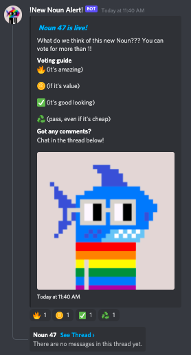

# SharkDAO Noun Alerter

SharkDAO Noun Alerter periodically checks for new Noun auctions. When a new auction begins, the bot posts in Discord, adds voting emojis to get a consensus, and creates a thread to discuss.



## Installation

install all npm modules:

```
npm install
```

rename `blank.env` to `.env` and edit accordingly

```
DISCORD_KEY=""
DISCORD_CHANNEL_ID=""
ETHERSCAN_KEY=""
JSON_RPC_URL=""
```

## Usage
```
node index.js
```

## Contributing
Pull requests are welcome. For major changes, please open an issue first to discuss what you would like to change.
